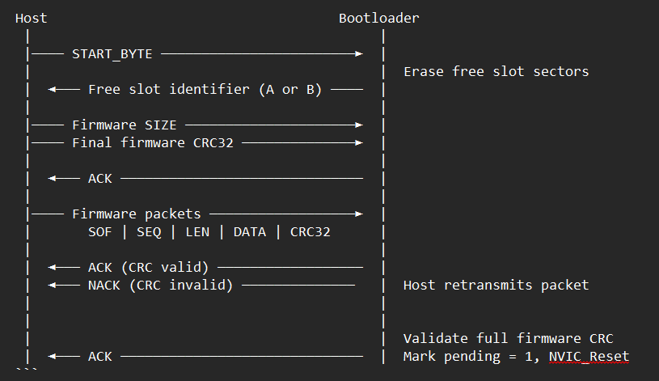
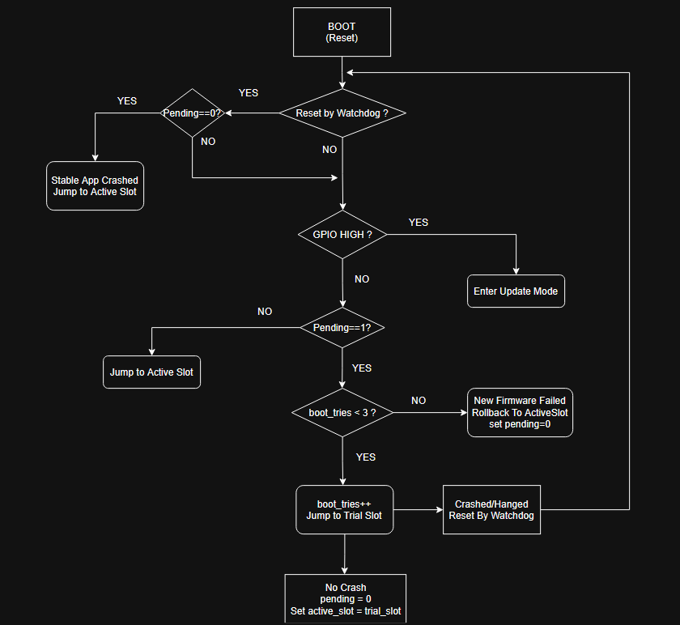

# STM32F401 Bootloader OTA Update Bluetooth

A bare-metal OTA bootloader for the STM32F401 that receives firmware updates over Bluetooth (HC-05) using a custom packet protocol. Features dual-slot storage, rollback protection, watchdog-based bad firmware detection and system recovery, and full CRC32 validation.

---

## Demo


---

## Flash Memory Layout

```
Sector 0-1  │  Bootloader   │  32 KB
Sector 2    │  Metadata     │  16 KB
Sector 3-5  │  Slot A       │  208 KB
Sector 6-7  │  Slot B       │  256 KB
```
Max firmware size: 208 KB

---

## Metadata Structure

Stored in Sector 2. Tracks the state of both firmware slots across resets.


`magic`       -   Validates that metadata section is not corrupted

`active_slot` -  The currently confirmed good slot (A or B)

`pending`     -  Set to 1 when a new firmware is waiting to be verified

`boot_tries`  -  Counts boot attempts of the pending firmware (max 3)

---

## How It Works

### Boot Decision

At startup the bootloader reads **PC10**:

PC10 HIGH  ->  Enter Update Mode

PC10 LOW   ->  Enter Boot Mode

---

### Update Mode



The host sends a firmware image compiled and linked for the specific slot address reported by the bootloader. After all packets are received the bootloader validates the full firmware CRC32. On success it marks `pending = 1` in metadata and resets the device.

---

### Packet Protocol

```
SOF(1) | SEQ(2) | LEN(2) | DATA(1-512) | CRC32(4)
```

- **CRC32** is calculated over the DATA segment only
- **SEQ** mismatch / CRC Invalid triggers a NACK 
- On **NACK** the host retransmits the same packet

---

### Boot Logic



If the firmware never calls `Confirm_Boot()` the watchdog resets the device. After 3 failed boot attempts `pending` is cleared and the bootloader falls back to the last confirmed `active_slot`.

---

## CRC32 Validation

Two layers of CRC32 validation are used:

Per-packet CRC32 - Detects corruption in transit

Full firmware CRC32 - Confirms complete image integrity before marking pending


---

## Rollback Protection

Firmware boots and confirms -> `active_slot` updated, `pending` cleared

Firmware crashes / hangs -> Watchdog resets device, `boot_tries` incremented

`boot_tries` reaches 3 -> `pending = 0`, boot falls back to previous `active_slot`

Corrupted OTA transfer -> Full firmware CRC fails, `pending` never set, system reset

---

## Project Structure

Bootloader_OTA_Update/       # Bootloader - lives permanently on chip

Bootloader_Application/      # Firmware image uploaded over Bluetooth


---

## Build Configurations

The `Bootloader_Application` project has two build configurations:

`SlotA` linked for Slot A base address (Sector 3) 0x0800C000

`SlotB` linked for Slot B base address (Sector 6) 0x08040000

The bootloader tells the host which slot is free. The host_python_script selects and sends the matching binary.

---
